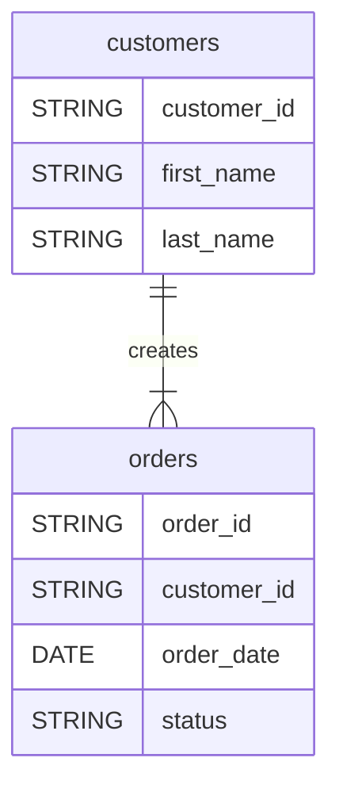

# dbt-diagrams

This tool allows you to

1. generate an Entity Relationship Diagram (ERD) based on `meta` config in your dbt model docs. Currently it relies on [Mermaid](https://mermaid.js.org/syntax/entityRelationshipDiagram.html) to render the output. You can choose to render your output inside your dbt docs directly, or store it as a separate SVG image.
1. Enable general Mermaid rendering capabilities to your dbt docs. Every Markdown code block tagged with `mermaid` will be rendered.

> [!TIP]
> [Demo Jaffle Shop docs pages](https://djlemkes.github.io/dbt-diagrams)

## Installation instructions

As `dbt-diagrams` is just a Python package. Install it using your favourite Python package manager (e.g. `pip install dbt-diagrams`). In case you want to render your ERD to a SVG image, you will have to install the `dbt-diagrams[svg]` extras package as well.

## Usage (1): add Mermaid rendering to dbt docs

Simply run `dbt-diagrams docs generate` instead of `dbt docs generate`. Any Markdown code block tagged with `mermaid` will now be picked up and rendered as an image.

## Usage (2): specify ERD in `meta` blocks and render in dbt docs

This will achieve the same functionality as (1), plus the following: let's say you have the following models defined in your dbt project

````yaml
version: 2

models:
  - name: customers
    description: >
      This table has basic information about a customer, as well as some derived facts based on a customer's orders

      ```mermaid[erd="customer_erd"]```
    config:
      meta:
        erd:
          connections:
            - diagram: customer_erd
              target: orders
              source_cardinality: one
              target_cardinality: one_or_more
              label: creates
    columns:
      - name: customer_id
        description: This is a unique identifier for a customer
      - name: first_name
        description: Customer's first name. PII.
      - name: last_name
        description: Customer's last name. PII.

  - name: orders
    description: >
      This table has basic information about orders, as well as some derived facts based on payments

      ```mermaid[erd="customer_erd"]```
    columns:
      - name: order_id
      - name: customer_id
        description: Foreign key to the customers table
      - name: order_date
        description: Date (UTC) that the order was placed
      - name: status
        description: '{{ doc("orders_status") }}'
````

Using the `meta` section of a model, you can define ERD connections to other models. Based on these connections and other table attributes the ERD can be generated. The `target` attribute is another dbt model name. Accepted relation cardinalities are `one`, `zero_or_one`, `zero_or_more` or `one_or_more`. Use the `label` attribute to specify a human readable interpretation to a relation. The `diagram` is optional and allows you to add a name to your ERD. This is useful in case you want to define multiple ERDs and reference them in dbt docs directly.

Notice the `mermaid[erd="cusomer_erd"]` expressions in the `customers` and `orders` model descriptions. When running `dbt-diagrams docs generate`, this will be replaced by the ERD Mermaid definition so that your ERD can be rendered in any dbt docs page.



## Usage (3): specify ERD in `meta` blocks and render as SVG

Given the same setup as above, you can also render your output to SVG:

1. Make sure you installed the `dbt-diagrams[svg]` extras. This will install a headless browser in which Mermaid can run.
1. Run `dbt-diagrams render-erds -dbt-target-dir target --format svg --output ./out`. This will use the `manifest` and `catalog` files from `./target` to render all defined ERDs as SVG. All detected diagrams will be stored as SVG files in the `./out` folder.

## ERD Definition schema

Every `erd` section inside a `meta` block of a model will be picked up. It should look like the following:

```yaml
erd:
  connections:
    - diagram: <Optional. This connection will be added to a diagram of this name>
      target: <Required. Other model name>
      source_cardinality: <Required. One of {zero_or_one, one, zero_or_more, one_or_more}>
      target_cardinality: <Required. One of {zero_or_one, one, zero_or_more, one_or_more}>
      label: <Optional. Any string that describes the relation from this model to target model.>
```
