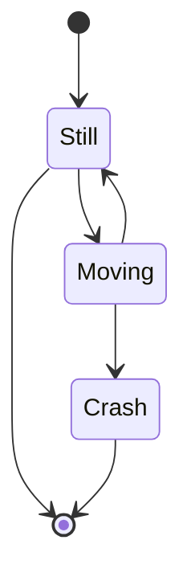



## Data Documentation for Jaffle Shop

This is an edited version of the original [Jaffle Shop Duckdb project](https://github.com/dbt-labs/jaffle_shop_duckdb) where [dbt-diagrams](https://github.com/DJLemkes/dbt-diagrams) functionality has been added.

Adding [dbt-diagrams](https://github.com/DJLemkes/dbt-diagrams) to your dbt project enables you to add any kind of Mermaid diagram:



On top of that, you can create one or more ERD's for your dbt project by adding a tiny bit of metadata to your dbt model docs:

```mermaid[erd='customer_erd']```


